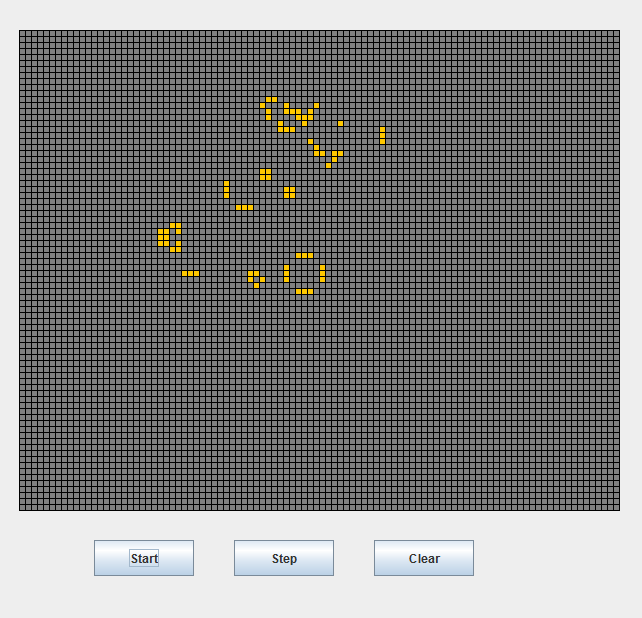
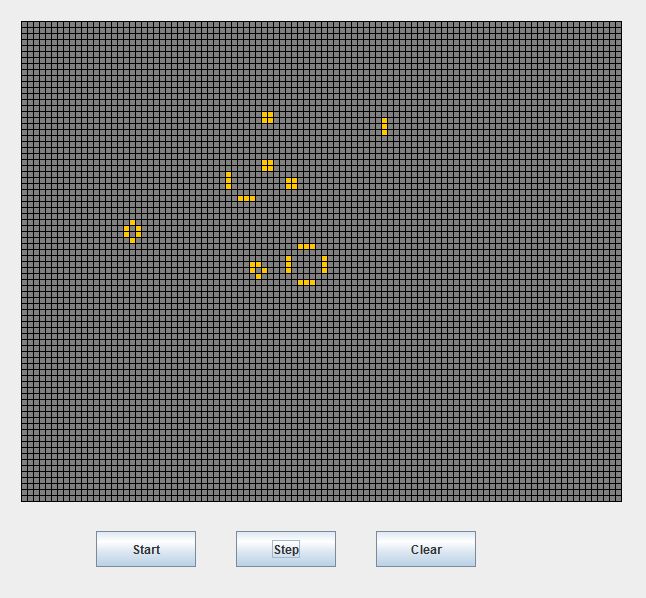

# conways-game-of-life
Conway's Game of Life is a cellular automaton developed by the British mathematician John Horton Conway in 1970.   

Examples  
--------
   
   
   

Rules of the Game    
-----
In each step of the game:   
* Any live cell with 0-1 live neighbors dies    
* Any live cell with 2-3 live neighbors lives    
* Any live cell with more than 3 live neighbors dies   
* Any dead cell with exactly 3 neighbors becomes live   

Read more:   
https://en.wikipedia.org/wiki/Conway%27s_Game_of_Life
https://bitstorm.org/gameoflife/
